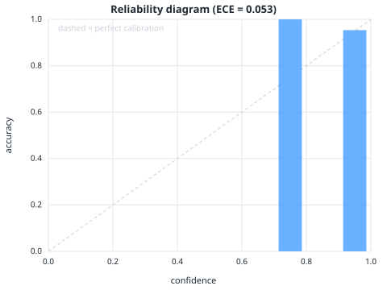
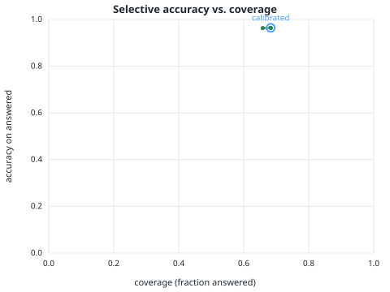

# helpdesk-agent


**A customer-support agent that replies only from the help centre, cites the article, and
escalates to a human when it can't — with the escalation threshold calibrated so wrong replies stay
under a target rate.**

**Live demo:** [helpdesk-agent-6wri.onrender.com](https://helpdesk-agent-6wri.onrender.com/) — a ticket inbox over a
fictional SaaS help centre; pick a ticket and watch the agent work. (Free tier: first load can take ~30 s to wake.)

Most support bots are a chat model with the help centre pasted in. They answer every ticket, and on
the tickets the help centre doesn't cover they answer *confidently and wrongly* — a made-up refund
window, an SLA that doesn't exist. For a business, one of those costs more than ten tickets routed
to a human. `helpdesk-agent` is the reliability layer: every ticket ends as a **cited reply draft**,
an **escalation with a hand-off note**, or an explicit **model-unavailable**, and the reply/escalate
decision is governed by a confidence threshold **calibrated on labelled tickets** (split-conformal
selective prediction), so *the rate of wrong replies is a number you set, not a hope.*

- 🎫 **Ticket in, decision out** — reply draft with the source article, or escalation with a hand-off note (what was searched, closest articles, why it stopped, what to add to the help centre)
- 🔁 **An agent, not a pipeline** — the LLM decides each step: search again with a reworded query, draft a reply, or stop because the help centre doesn't cover it
- 📉 **Calibrated escalation** — threshold set on 68 labelled Northwind tickets for a 10% error target; measured **3.6%** on the held-out split
- 🧠 **Self-consistency confidence** — agreement across N independent reply samples (clustered by meaning), not the model's self-reported number
- 🚦 **Outages are never escalations** — a rate-limited or failed call is reported as "model unavailable", with the HTTP status, never as "not covered"
- 🖥️ **Support console** — a ticket inbox: the agent handles tickets while you watch each step stream live (search → judge → draft → decide); send the reply or escalate; browse the help centre; compare with a plain chatbot
- 📁 **Your own help centre** — `ingest.py` indexes a folder of articles; label ~50 of your tickets and calibrate the threshold for *your* domain
- 📊 **Measured** — calibration, groundedness, agent behaviour, an ablation against single-shot, and bootstrap CIs; also run on SQuAD 2.0 as a public benchmark
- 🪶 **Zero dependencies** — standard library only: retrieval, server, UI, charts, API client

---

## Results on the help centre

The Northwind Workspace help centre (30 articles, 6 categories, committed in `knowledge_base/`) and
**68 labelled tickets**: 46 answerable (gold answer + article) and 22 plausible tickets it does
**not** cover (on-prem version, startup discount, Teams integration …). 27 tickets calibrate the
threshold, **41 held-out tickets** report the numbers. Model `gemini-2.5-flash`, error target
α = 0.10.

| held-out tickets (n=41) | Chatbot (always replies) | Agent, no threshold | **Agent, calibrated** |
|---|---:|---:|---:|
| **Wrong replies to uncovered tickets** | 100% | 0.0% | **0.0%** |
| **Accuracy of replies sent** | 65.9% | 96.4% | **96.4%** `[88, 100]` |
| Correct outcome (right reply *or* correct escalation) | 65.9% | 95.1% | 95.1% |
| Tickets auto-resolved | 100% | 68.3% | 68.3% `[54, 83]` |
| Selective error vs target | — | — | **3.6% ≤ 10%** `[0, 12.5]` |

`[...]` = 95% bootstrap CI. Three honest readings:

1. **Escalation is the whole game.** A chatbot that always replies gets 34% of tickets wrong — every
   uncovered ticket becomes an invented policy. Letting the agent say "not covered" takes correct
   outcomes to 95% and wrong replies on uncovered tickets to **zero**.
2. **On this help centre the threshold didn't need to bite.** Calibration found that the agent's own
   "not covered" judgement already meets the 10% target, so τ = 0.00 and the two agent columns match.
   The gate is a safety net: on the harder SQuAD benchmark the same procedure sets τ = 1.00 (reply only
   on unanimous samples) to hold a 20% target. You choose α; the data chooses τ.
3. **Citations are grounded.** On every correctly resolved ticket the cited article is the gold one
   (100%, 38/38).

**Confidence signal.** Clustering reply samples by *meaning* (token-F1, so "$12" and "$12 per user
per month" agree) brought self-consistency ECE from 0.156 to **0.053**; the model's self-reported
confidence is 0.028 here but 0.247 on SQuAD, where it over-claims — self-consistency is the signal
that survives both.

<p>


</p>

Full methodology, the SQuAD 2.0 benchmark (300 questions), the agent-loop ablation, behaviour and
groundedness analyses: **[EVALUATION.md](EVALUATION.md)**.

---

## How it works

```
ticket
   │
   ▼  search(ticket text)                       ── tool call → top-k articles
┌── agent loop (bounded) ───────────────────────────────────────────────────────────┐
│  decide: the LLM reads the gathered articles and picks the next action            │
│     • answer   → articles are sufficient, draft a reply                           │
│     • search   → insufficient; reformulate the query and loop                     │
│     • abstain  → the help centre doesn't cover this; stop                → ESCALATE│
└───────────────────────────────────────────────────────────────────────────────────┘
   │  (answer)
   ▼
[A] Self-consistency   N independent reply samples from ONLY the gathered articles;
   │                   confidence = share that agree on the key fact; cite the article
   ▼
[B] Conformal gate     reply iff confidence ≥ τ, τ calibrated on labelled tickets for target α
   ▼
RESOLVED: reply draft + source article + confidence    or    ESCALATED: hand-off note
```

**Two ways to escalate, one way to fail.** The agent can judge the help centre doesn't cover a
ticket (one cheap call), or the confidence can fall below τ after drafting. A failed API call is a
*third* outcome — `model unavailable` — and is never reported as either of the first two.

**The hand-off note is deterministic** — built from the trace (queries run, closest articles,
reason), no extra model call — so it is always there, never invents, and tells the team what to add
to the help centre so the next such ticket resolves itself.

---

## Quickstart

No install (Python 3.10+, standard library only). Set a Gemini key:

```bash
export GEMINI_API_KEY=...

python serve.py                 # support console (inbox + live agent trace) at http://localhost:8000
python ask.py "Can we pay by bank transfer?"            # -> cited reply draft
python ask.py "Do you have an on-prem version?"         # -> escalated, with closest articles

# your own help centre
python ingest.py ./help-centre --name "Acme"            # .md/.txt articles -> data/index.json
python serve.py                                         # now answers from your articles

# evaluation
python evaluate.py --alpha 0.10                         # calibrate on knowledge_base/tickets.json
python evaluate.py --dataset squad --alpha 0.20         # public benchmark
python -m eval.ablation; python -m eval.behavior        # loop vs single-shot; behaviour + CIs
python -m unittest discover -s tests -v                 # offline: unit, eval gate, KB consistency
```

JSON API: `GET /meta`, `GET /articles`, `GET /inbox`, `POST /inbox {"message"}`, `GET /inbox/<id>/stream`
(server-sent events, one per agent step), `POST /inbox/<id>/send|escalate|reopen`, `POST /ticket {"message"}`
(one-shot), `POST /compare {"message"}`, `GET /health`.

Config via env: `HDA_MODEL`, `HDA_EMBED_MODEL`, `HDA_RETRIEVER=tfidf|hybrid`, `HDA_THRESHOLD`
(override τ), `HDA_SAMPLES` (reply samples per ticket, default 5), `HDA_MAX_STEPS` (loop bound,
default 3). The provider is isolated to `helpdesk_agent/llm.py`.

**Rate limits.** A ticket costs ~1 decision call + `HDA_SAMPLES` samples. Gemini's free tier allows
roughly 10–15 requests/minute, so on a free key set `HDA_SAMPLES=3` (the Render blueprint does).
When the API rate-limits, the console says **model unavailable** with the status code.

### Deploy

`render.yaml` is a one-click [Render](https://render.com) blueprint: **New → Blueprint → this repo →
paste `GEMINI_API_KEY`**. Boots in under a second (lexical retrieval over the committed help centre).

### Calibrating for your own help centre

The shipped τ is right for Northwind. For yours: ingest your articles, write ~50 tickets as
`knowledge_base/tickets.json` does (`question`, accepted `answers`, the `article` slug, and
`is_impossible: true` for tickets you know aren't covered), then `python evaluate.py`. The threshold
in `results/helpdesk/results.json` is then calibrated on your domain and `serve.py` picks it up.

---

## Repo layout

```
helpdesk_agent/
  agent.py        # the agent: bounded decision loop (search / reformulate / reply / escalate)
  tools.py        # tools the agent can call (search over the help centre)
  llm.py          # model-agnostic client: decisions, reply samples, LLMError (swap for Claude/GPT)
  retriever.py    # TF-IDF + hybrid (RRF of lexical + dense) retrieval
  embeddings.py   # Gemini embeddings with on-disk cache + graceful fallback
  conformal.py    # split-conformal selective-prediction threshold
  corpus.py       # help centre / ingested corpus loader; threshold selection
  datasets.py     # labelled sets: helpdesk tickets, SQuAD 2.0
  metrics.py      # EM/F1, ECE, reliability bins
  charts.py       # hand-written SVG charts
  trace.py        # append-only JSONL ticket log
  ui/index.html   # the support console (no build step, no CDN)
knowledge_base/   # 30 Northwind articles in 6 categories + 68 labelled tickets
serve.py          # console + JSON API         ask.py  # CLI         ingest.py  # your articles
evaluate.py       # calibration run → results/<dataset>/
eval/             # ablation.py (loop vs single-shot), behavior.py (behaviour, groundedness, CIs), stats.py
tests/            # unit (test_core), end-to-end eval gate, knowledge-base consistency
results/helpdesk/ results/squad/   # committed numbers and charts
```

Design decisions and extension points: [ARCHITECTURE.md](ARCHITECTURE.md).

---

## Honest limits

- **One help centre, read-only.** No account lookups or actions; those are tool extension points.
- **Northwind is fictional and small.** 30 clean articles make retrieval easy (97.8% recall@3) and
  leave the agent loop little to recover; the loop's value shows on larger, messier corpora, and the
  SQuAD run is there to show the method under harder conditions.
- **68 tickets is a small calibration set.** The 10% target holds at the point estimate with an
  upper CI of 12.5%; at α = 0.05 the split is too coarse and conformal falls back to escalate-all.
  More labelled tickets tighten both.
- **Citation ≠ entailment.** We check the cited article is the gold one, not that every clause of
  the reply is entailed by it.
- **Self-consistency is not a proof.** A consistently wrong model still passes; the conformal layer
  bounds that risk empirically.

MIT licensed.
