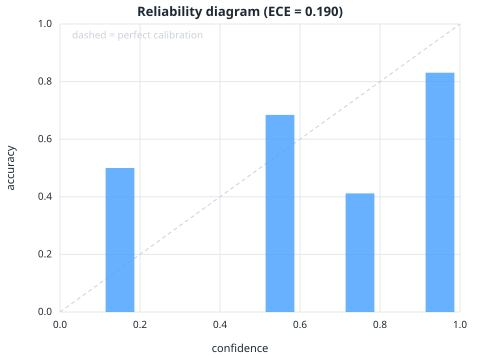
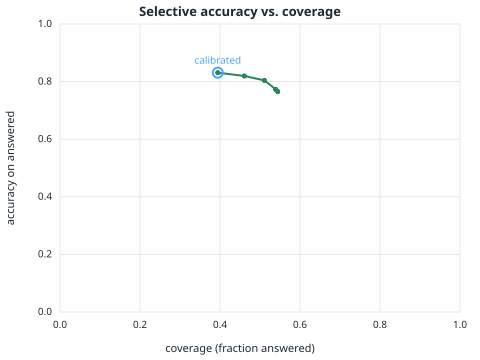

# calibrated-rag-agent


**A retrieval agent that decides its own search strategy — and knows when to abstain, with a
conformal-calibrated confidence.**

Most RAG systems run a fixed path (retrieve once → answer) and answer *every* question, so they
confidently hallucinate on the ones they can't actually support. In production that's the whole
problem: you can't deploy an agent you can't trust. `calibrated-rag` fixes both halves. It's a real
**agent** — a bounded decision loop where the LLM uses a search tool, judges whether the passages
actually answer the question, **reformulates and searches again** when they don't, and decides for
itself whether to answer or give up. And when it does answer, that decision is governed by a
confidence threshold **calibrated with split-conformal selective prediction**, so *when it answers,
it's right at a target rate you set.*

Evaluated on **SQuAD 2.0** (which deliberately includes unanswerable questions), measuring not just
accuracy but **calibration, hallucination rate, and the accuracy/coverage tradeoff.**

- 🔁 **Agentic decision loop** — the LLM chooses to search / reformulate / answer / abstain each step, not a fixed pipeline
- 🛠️ **Tool use** — a `search` tool the agent calls with its own (re)formulated queries
- 🧠 **Self-consistency confidence** (agreement across samples), not the LLM's miscalibrated "100%"
- 📉 **Conformal abstention** with a risk target — a reliability guarantee on answered questions
- 🔎 **Citations** — every answer points to the passage that supports it
- 🔀 **Hybrid retrieval** — TF-IDF + Gemini embeddings fused with Reciprocal Rank Fusion (lexical fallback)
- 🖥️ **Web interface + CLI** — see the knowledge base it answers from, the answer or the stated reason for abstaining, confidence vs threshold, the cited passage, and the full agent trace; compare side-by-side with the same model given no documents (`serve.py`)
- 🚦 **Outages are not abstentions** — a failed or rate-limited model call is reported as "model unavailable", never as "the agent judged it unanswerable"
- 📁 **Bring your own docs** — index a folder and query it, not just the benchmark (`ingest.py`)
- 📊 **Measured, not claimed** — selective accuracy, ECE, hallucination reduction, accuracy-vs-coverage
- ✅ **Tested + CI** — offline unit tests (incl. the agent loop) run in GitHub Actions
- 🪶 **Zero dependencies** — pure Python stdlib (retrieval, charts, HTTP server, API client)

---

## Results

SQuAD 2.0 dev slice — **300 questions** (140 unanswerable) over 32 passages, model
`gemini-2.5-flash`, target error α = 0.20. Three systems, same underlying model:

| | Naive RAG (answers all) | + model self-check | **+ conformal dial** |
|---|---:|---:|---:|
| **Hallucination rate on unanswerable Qs** | 100% | 16.9% | **9.0%** |
| **Accuracy on answered questions** | 41% | 74.5% | **81.9%** |
| Task accuracy (answer correctly *or* abstain) | 41% | 81.7% | 77.8% |
| Coverage (fraction answered) | 100% | 54% | 40% |

95% bootstrap CIs on the calibrated column (test split, n=180): selective accuracy
**81.9% [72.9, 90.6]**, hallucination **9.0% [3.4, 15.7]**, coverage **40.0% [32.8, 47.2]** —
see [EVALUATION.md](EVALUATION.md). Two things to read here:

1. **Abstention is the whole game.** A vanilla RAG that always answers hallucinates on *every*
   unanswerable question (100%) and lands at 41% task accuracy. Letting the agent say "I can't
   answer this" takes task accuracy to 82%.
2. **The conformal layer adds a tunable *guarantee* on top.** Set a target error α; it calibrates
   the confidence threshold on held-out data so accuracy on answered questions clears it — verified
   on a disjoint test split (**18.1% error ≤ 20% target**). It lifts answered-accuracy from 75% to
   **82%** and cuts the hallucination rate on unanswerable questions by nearly half (17% → **9%**), at
   a coverage cost. A naive RAG gives you no such dial.

**Calibration ablation — the confidence signal matters.** With the same model, the *raw
self-reported* confidence gives ECE **0.247**; **self-consistency** (agreement across samples) gives
ECE **0.190**. A better-calibrated signal is what makes the abstention threshold trustworthy.

**Agent ablation — the loop earns its place.** Versus a single-shot baseline (retrieve once, answer)
on the same slice: the agent lifts gold-passage recall (98.8% → 99.4%) and cuts hallucination
(20.2% → 16.9%, trust-model policy) at **no extra average cost** (4.6 vs 5.0 LLM calls/query —
early abstention skips answer sampling). And under the same α=0.20 target the single-shot system's
confidence couldn't meet the error bound at *any* coverage (conformal fell back to abstain-all),
while the agent met it at 40% coverage. Full numbers, behaviour, and groundedness (citations point to
the gold passage **100%** of the time on correct answers) in **[EVALUATION.md](EVALUATION.md)**.

<p>


</p>

Left: how closely the self-consistency confidence tracks real accuracy. Right: the core tradeoff —
answer fewer questions, and the ones you answer get more accurate; the circled point is the
calibrated operating point.

### Retrieval ablation

Retrieval is **hybrid** — TF-IDF fused with Gemini embeddings via Reciprocal Rank Fusion, with
automatic lexical-only fallback when no embedding key is present. Recall of the gold passage on the
same 300 questions:

| recall@k | lexical (TF-IDF) | hybrid |
|---|---:|---:|
| @1 | 93.7% | **96.0%** |
| @3 | 98.3% | **99.3%** |
| @5 | 99.3% | 99.7% |

On this small, clean corpus both saturate by k=5; hybrid's edge (notably at @1) grows on larger,
noisier document sets. `CRAG_RETRIEVER=tfidf` forces lexical-only.

---

## How it works

It's an **agent**, not a fixed pipeline: at each step the LLM looks at what it has retrieved and
**chooses its next action** — search again with a reformulated query, answer now, or abstain —
instead of running a hard-coded retrieve→answer path. The loop is bounded so it always terminates,
and the final answer still faces the calibrated confidence gate.

```
question
   │
   ▼
 ┌─────────────────────────────  agent loop (bounded)  ─────────────────────────────┐
 │  search(query)        tool call → top-k passages added to working context        │
 │       │                                                                           │
 │       ▼                                                                           │
 │  decide  ── the LLM judges the gathered passages and picks the next action: ──┐   │
 │       │        • answer   → passages are sufficient, go answer                │   │
 │       │        • search   → insufficient; reformulate the query and loop ◀────┘   │
 │       │        • abstain  → answer isn't in this corpus; stop                     │
 └───────┼───────────────────────────────────────────────────────────────────────┘
         ▼  (answer)
[A] Self-consistency   the model answers from ONLY the gathered passages, N times
   │                   concurrently; confidence = agreement across the N samples
   ▼
[B] Conformal gate     calibrated threshold τ (target error α on a held-out split):
   │                   answer iff confidence ≥ τ, else abstain
   ▼
answer + cited passage + confidence     OR     "I can't answer this reliably"
```

**Two ways it abstains.** The agent can *decide* the corpus can't support an answer (step `abstain`
in the loop), and — independently — the self-consistency confidence can fall below the calibrated
threshold (step B). Both protect against confident nonsense.

**The core idea (step B).** A single LLM confidence is poorly calibrated — the model says it's
certain even when it's wrong. So confidence here is *self-consistency*: ask several times, measure
agreement. Then, instead of picking a threshold by hand, we **calibrate** it: on a held-out split
we find the lowest confidence threshold whose empirical error among answered questions is ≤ α, and
verify the guarantee holds on a disjoint test split. This is the selective-prediction / conformal
risk-control idea — trade a little coverage for a reliability guarantee on what you answer.

---

## Quickstart

No install needed (Python 3.10+, standard library only). Set a Gemini API key:

```bash
export GEMINI_API_KEY=...        # or GEMENI_API_KEY
```

```bash
# Web interface — open http://localhost:8000
#   left: every passage the agent can answer from (filterable; retrieved + cited ones highlight)
#   right: answer or abstention with its reason, confidence vs calibrated threshold, cited
#          passage, the agent's trace (each search, decision, failed call), and a
#          "compare with a plain LLM" button that asks the same model with no documents
python serve.py
# JSON API: GET /meta, GET /corpus, POST /ask {"question"}, POST /compare {"question"}

# Ask from the CLI
python ask.py "Who was yersinia pestis named for?"    # -> Alexandre Yersin (with citation)
python ask.py "What is the capital of Mars?"          # -> abstains

# Query YOUR OWN documents instead of the demo corpus
python ingest.py path/to/docs --name "My Docs"        # index a folder of .txt/.md
python serve.py                                       # now answers over your docs

# Reproduce the evaluation (downloads SQuAD 2.0, runs the agent, writes results + charts)
python evaluate.py --alpha 0.20

# Measure retrieval quality (lexical vs hybrid recall@k)
python retrieval_eval.py

# Production eval suite
python -m eval.ablation --alpha 0.20   # agent loop vs single-shot baseline
python -m eval.behavior                # behaviour, groundedness, calibration w/ bootstrap CIs

# Run the tests (offline, no API key needed) — unit + end-to-end eval gate
python -m unittest discover -s tests -v
```

Config via env: `CRAG_MODEL` (LLM), `CRAG_EMBED_MODEL` (embeddings), `CRAG_RETRIEVER=tfidf|hybrid`,
`CRAG_THRESHOLD` (abstention cutoff for custom corpora), `CRAG_SAMPLES` (answer samples per
question, default 5), `CRAG_MAX_STEPS` (decision-loop bound, default 3). The LLM provider is
isolated to `calibrated_rag/llm.py`, so moving to Claude or GPT is a small change.

**Rate limits.** A question costs ~1 decision call + `CRAG_SAMPLES` answer samples (plus one per
reformulation). Gemini's free tier allows roughly 10–15 requests/minute, so on a free key set
`CRAG_SAMPLES=3` (the Render blueprint does). If the API rate-limits or the key is bad, the
interface reports **model unavailable** with the HTTP status — it never passes an outage off as an
abstention.

### Deploy

A `render.yaml` blueprint is included for a free one-click deploy on
[Render](https://render.com): **New → Blueprint → pick this repo → paste your `GEMINI_API_KEY`**.
The hosted demo boots in under a second (TF-IDF over a small committed corpus) and answers readily
while still abstaining on unanswerable questions.

---

## Repo layout

```
calibrated_rag/
  agent.py        # the agent: bounded decision loop (search/reformulate/answer/abstain) + self-consistency
  tools.py        # tools the agent can call (search over the corpus); extensible
  llm.py          # model-agnostic answer-or-abstain + decision client (stdlib urllib)
  embeddings.py   # Gemini embeddings with on-disk cache + graceful fallback
  retriever.py    # TF-IDF + hybrid (RRF of lexical + dense) retrieval
  conformal.py    # split-conformal selective-prediction threshold
  metrics.py      # SQuAD EM/F1, ECE, reliability bins
  charts.py       # hand-written SVG reliability + coverage charts
  corpus.py       # load the SQuAD slice OR an ingested custom corpus
  data.py         # SQuAD 2.0 loader
  trace.py        # append-only JSONL query trace (observability)
  ui/index.html   # the web interface (served by serve.py; no build step, no CDN)
evaluate.py       # full QA evaluation → results/results.json + charts
retrieval_eval.py # retrieval ablation (lexical vs hybrid recall@k)
eval/
  stats.py        # bootstrap confidence intervals (uncertainty on every metric)
  behavior.py     # agent behaviour, reformulation recovery, citation groundedness, calibration CIs
  ablation.py     # agent decision loop vs single-shot baseline — does the loop earn its calls?
serve.py          # zero-dep web interface + JSON API (/meta, /corpus, /ask, /compare)
ask.py            # interactive CLI
ingest.py         # index your own .txt/.md docs
tests/            # offline tests: unit (test_core) + end-to-end eval gate (test_eval_gate)
.github/workflows/ci.yml   # runs the tests on every push/PR
```

Full methodology, metrics, and results in **[EVALUATION.md](EVALUATION.md)**.

See [ARCHITECTURE.md](ARCHITECTURE.md) for the design decisions and extension points.

---

## Design notes & honest limits

- **Retrieval is hybrid** (TF-IDF + Gemini embeddings, fused with Reciprocal Rank Fusion), with an
  automatic lexical-only fallback when no embedding key is available. A cross-encoder reranker would
  be the next step and is isolated to `retriever.py`.
- **Confidence = self-consistency over N samples.** Cheap and far better calibrated than
  self-reported confidence, but a model that is *consistently* wrong can still slip through — the
  conformal layer bounds the risk, it doesn't eliminate it.
- **Conformal guarantee is split-conformal / finite-sample**, reported empirically on a held-out
  test split rather than proven here; with a small slice the coverage estimate has variance.
- **Calibration is corpus-specific.** The conformal threshold is calibrated on SQuAD and is the
  right number *for that benchmark*. On your own documents there's no labeled data to calibrate
  against, so `ingest` mode uses a sensible default (answer when ≥ 3/5 samples agree); override with
  `CRAG_THRESHOLD=0.x`, or supply a labeled Q&A set to get a real guarantee for your corpus.
- **The agent loop is bounded and costs calls.** It adds one decision call per step (default ≤ 3
  steps, `CRAG_MAX_STEPS`) on top of the N answer samples, and refuses to repeat a query so it can't
  spin. On a small, clean corpus the first retrieval is usually enough, so the reformulation earns
  its keep mainly on larger/noisier document sets where the first query misses.
- **Scope is intentionally tight** (one corpus, read-only QA) so the contributions — *an agent that
  directs its own retrieval* and *calibrated abstention* — are the things done well.

---

## Why I built this

Agents that run real work fail on *trust*, not capability — they hallucinate confidently and nobody
can rely on them. The interesting engineering is making them know when **not** to answer, with a
number behind it. This is a small, honest demonstration of exactly that.

MIT licensed.
